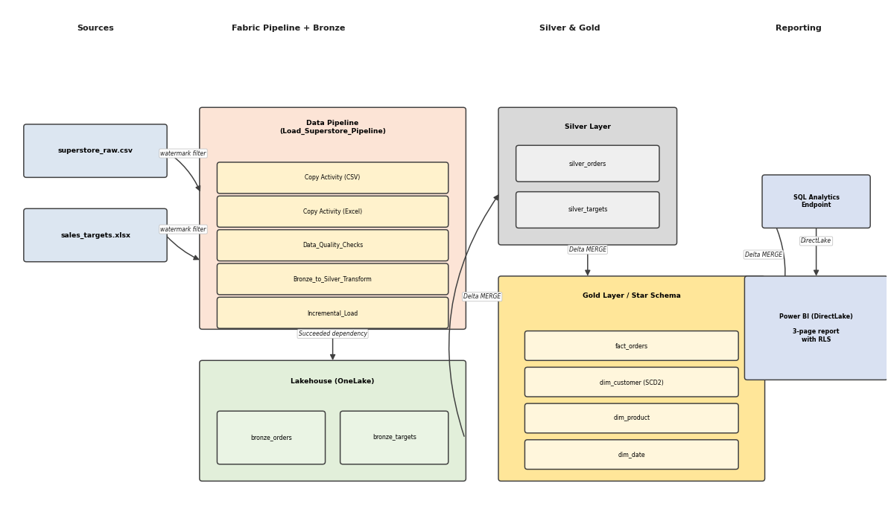

# Superstore Sales Analytics Platform
## Microsoft Fabric + Power BI | End-to-End Data Engineering & Reporting
## Project Summary
One paragraph. What was built, what tools were used, what business question it
answers.
Example: 'An end-to-end retail sales analytics platform built on Microsoft Fabric.
Ingests raw Superstore sales data from CSV and Excel sources, transforms it through
a Bronze-Silver-Gold medallion architecture, and serves a published Power BI
dashboard with Row-Level Security, 17 DAX measures, and daily automated refresh.'
## Architecture

Brief description of each layer in 2-3 sentences.
## What I Built
- **Data Pipeline**: Microsoft Fabric Data Pipeline with parallel ingestion,
data quality gate, and daily scheduled automation
- **Bronze layer**: Raw Delta tables -- superstore orders + sales targets
- **Silver layer**: Cleaned, typed, standardised (PySpark transform)
- **Gold layer**: Star schema -- fact_orders + dim_customer + dim_product + dim_date
- **Advanced features**: SCD Type 2 on dim_customer, window function rankings,
incremental loading with processed_timestamp watermark
- **Power BI report**: 3 pages, 17 DAX measures, drill-through, bookmarks,
custom tooltips, Row-Level Security
## Tools & Technologies
| Tool | Purpose |
|------|---------|
| Microsoft Fabric | Lakehouse, Pipelines, Notebooks, Monitoring |
| Apache Spark (PySpark) | Data transformation and modelling |
| Delta Lake | Versioned storage with ACID transactions |
| Dataflow Gen2 | Low-code dimension table rebuild |

| Power BI | Dashboard, DAX measures, RLS, DirectLake |
| SQL Analytics Endpoint | Ad-hoc querying and audit verification |
## Key Technical Decisions
3-4 bullet points explaining WHY you made specific choices.
Example: 'Used processed_timestamp (not order_date) as the watermark column
to correctly handle late-arriving data in the incremental load.'
## Live Report
[View the published Power BI report](paste-your-workspace-report-URL-here)
## Repository Structure
Brief description of each folder.
## Dataset
Superstore Sales dataset from Kaggle (public domain).
Raw files not included in this repository.
# superstore-fabric-analytics
End-to-end Microsoft Fabric data engineering and Power BI analytics project using PySpark, Delta Lake, Medallion Architecture, and CI/CD with GitHub.
